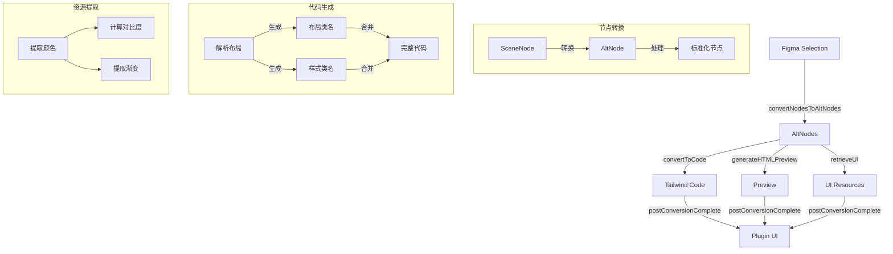

# Figma to Tailwind 转换框架

## 1. 整体架构

### 1.1 转换流程


### 1.2 核心模块

#### 1.2.1 节点转换
```typescript
// 将Figma节点转换为标准AltNode
export const convertNodesToAltNodes = (
  nodes: ReadonlyArray<SceneNode>,
  parent: BaseNode | null
): Array<AltNode> => {
  // 转换节点
  // 处理父子关系
  // 返回AltNode数组
}
```

主要功能：
- 将Figma的SceneNode转换为统一的AltNode格式
- 处理节点间的父子关系
- 标准化节点属性

#### 1.2.2 代码生成
```typescript
// 主转换函数
export const convertToCode = async (
  nodes: Array<AltNode>,
  settings: PluginSettings
): Promise<string> => {
  // 解析节点
  // 生成代码
  // 返回Tailwind代码
}

// 布局转换
const handleLayout = (node: AltLayoutMixin): string[] => {
  // 处理Auto Layout
  // 处理约束
  // 返回布局类名
}

// 样式转换
const handleStyle = (node: AltNode): string[] => {
  // 处理颜色
  // 处理尺寸
  // 处理特效
  // 返回样式类名
}
```

转换规则：
1. **布局转换**
   - Auto Layout → Flexbox
   ```typescript
   // 水平布局
   layoutMode === "HORIZONTAL" → "flex flex-row"
   // 垂直布局
   layoutMode === "VERTICAL" → "flex flex-col"
   // 间距
   itemSpacing → "gap-{size}"
   ```

2. **对齐方式**
   ```typescript
   // 主轴对齐
   primaryAxisAlignItems === "CENTER" → "justify-center"
   primaryAxisAlignItems === "MAX" → "justify-end"
   // 交叉轴对齐
   counterAxisAlignItems === "CENTER" → "items-center"
   counterAxisAlignItems === "MAX" → "items-end"
   ```

3. **尺寸转换**
   ```typescript
   // 固定尺寸
   width → "w-{size}"
   height → "h-{size}"
   // 自适应
   layoutGrow → "flex-grow"
   ```

4. **颜色转换**
   ```typescript
   // 背景色
   fills → "bg-{color}"
   // 文字颜色
   color → "text-{color}"
   // 边框颜色
   strokes → "border-{color}"
   ```

#### 1.2.3 预览生成
```typescript
// 生成HTML预览
export const generateHTMLPreview = async (
  nodes: Array<AltNode>,
  settings: PluginSettings,
  code: string
): Promise<{
  size: { width: number; height: number };
  content: string;
}> => {
  // 生成预览HTML
  // 计算尺寸
  // 返回预览数据
}
```

#### 1.2.4 UI资源提取
```typescript
// 提取颜色
export const retrieveGenericSolidUIColors = (
  framework: FrameworkTypes
): ColorResult[] => {
  // 提取颜色
  // 计算对比度
  // 返回颜色数据
}

// 提取渐变
export const retrieveGenericLinearGradients = (
  framework: FrameworkTypes
): GradientResult[] => {
  // 提取渐变
  // 生成预览
  // 返回渐变数据
}
```

### 1.3 配置项

```typescript
interface PluginSettings {
  // 框架选择
  framework: "Tailwind";
  
  // 代码格式
  jsx: boolean;              // 是否生成JSX
  
  // 布局选项
  optimizeLayout: boolean;   // 优化布局结构
  layerName: boolean;        // 保留图层名
  responsiveRoot: boolean;   // 响应式根节点
  
  // 样式选项
  inlineStyle: boolean;      // 使用内联样式
  roundTailwindValues: boolean;    // 四舍五入数值
  roundTailwindColors: boolean;    // 四舍五入颜色
  customTailwindColors: boolean;   // 自定义颜色
}
```

### 1.4 输出示例

```html
<!-- 基础布局 -->
<div class="flex flex-col gap-4 p-6">
  <!-- 子元素 -->
  <div class="flex items-center justify-between">
    <h1 class="text-2xl font-bold text-gray-900">标题</h1>
    <button class="bg-blue-500 text-white px-4 py-2 rounded">
      按钮
    </button>
  </div>
  
  <!-- 图片容器 -->
  <div class="relative w-full h-64">
    
  </div>
</div>
```

### 1.5 注意事项

1. **节点处理**
   - 处理隐藏节点
   - 保持节点层级
   - 处理特殊组件

2. **样式转换**
   - 处理复杂渐变
   - 处理混合模式
   - 处理自定义效果

3. **性能优化**
   - 缓存转换结果
   - 减少重复计算
   - 优化选择器生成

4. **代码质量**
   - 生成语义化标签
   - 保持代码可读性
   - 添加必要注释